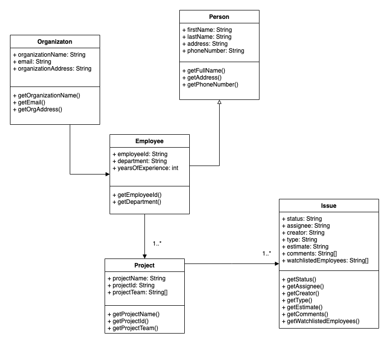

# Final project

## Project title - Sprint planner

## Project details

What is sprint planner ?

- A sprint planner is a set of statuses and transitions that an issue moves through during its lifecycle and typically represents processes within your organization.
- Sprint planner helps the scrum team to organize their tasks for any sprint and follow agile methodologies.
- Sprint planner provides features which lets you track issue and bugs related to your software.
- Sprint planner also provides additional featured which lets a user track the progress graphically as well.
- Sprint planner lets a particular user filter out the issues based on his preference to provide a more enhanced user experience which will be persisted throughout the session.
- Sprint planner provides instant notification for the user associated with the ticket via emails.
- Sprint planner provides a way to connect with all the stakeholders of an issue.
- Sprint planner lets you link tickets which solves the same issue.

## User Story:

- As a user, I should be able to open the sprint planner and login using my organizations credentials.
- As a user, I should be able to create any number of sprints and set a start and end date.
- As a user, I should be able to create an issue in any sprint and provide the initial details (like the issue description and if its a bug then the ways to reproduce it).
- As a user, I should be able to assign any task to either myself or someone working in the team.
- As a user, I should be able to change the status of the issue to different stages (Open, in-progress, done, implemented, accepted)
- As a user, I should be able to assign a type(bug, story, task) to the issue.
- As a user, I should be able to search for a particular issue either by the ticket number or the one who it assigned to.
- As a user, I should be able to filter out all the issue based on certail criterias.
- As a user, I should be able to move the tickets to different sprints.
- As a user, I should be able to send an email to all the people who are associated with the ticket when any changes are made to it.
- As a user, I should be able to see the burn-out chart at the end of a sprint.
- As a user, I should be able to fetch the code base from the github through the sprint planner.
- As a user, I should be able to perform CRUD operations on the issues.
- As a user, I should be able to get notifications when any changes are made to an issue if I'm subscribed to its watchlist.
- As a user, I should be able to know when was the last update made to any issue.
- As a user, I should be able to add comments on any issue.
- As a user, I should be able to add attachments to a ticket.
- As a user, I should be able to see the graphical representation of the progress done in a particular sprint.
- As a user, I should be able to link tickets with another ticket.

